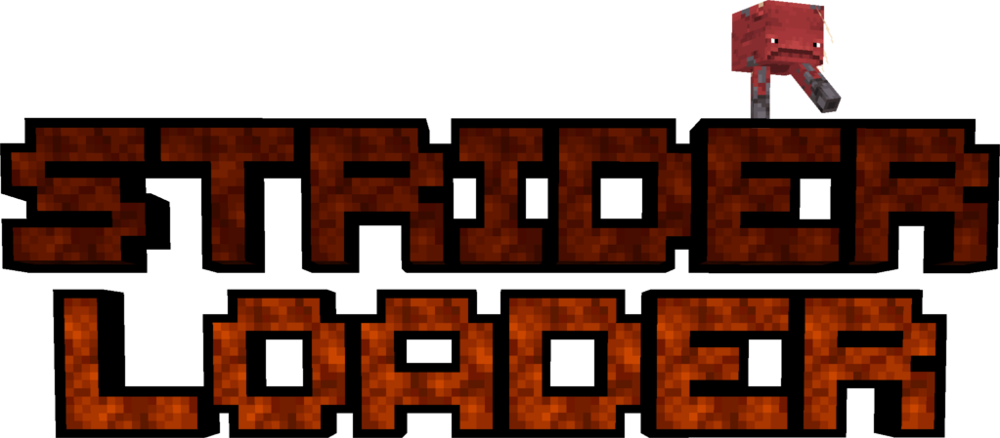

  
   
  

**StriderLoader** is a lightweight addon loader for Minecraft.

## Features

* Simple and powerful addon loading system
* Advanced crash detail display
* Compatible with all JVMs version 25 or higher
* Startup UI showing loader stages (can be disabled)
* Works on both Minecraft client and server
* Separate addon jar folder: `/addons`

## Minecraft Version Support

StriderLoader versions may support different Minecraft versions over time.

As StriderLoader evolves, newer loader versions can add support for additional Minecraft versions without necessarily requiring a major StriderLoader release.

For every new Minecraft version, a minimum StriderLoader version supporting it will be released shortly after the Minecraft release. This ensures that new Minecraft versions can be supported while allowing existing StriderLoader versions to continue supporting the Minecraft versions they were designed for.

The minimum StriderLoader version required for a Minecraft version is defined by StriderLoader's compatibility configuration.

## Creating a StriderLoader Addon

A ready-to-use template for creating **StriderLoader addons** is available in the [strider-example-addon repository](https://github.com/nozyx12/strider-example-addon).

The template provides the basic project structure and configuration needed to get started with StriderLoader addon development.

You can use it as a starting point for your own addon and customize it to fit your project.

## Versioning

StriderLoader follows a semantic versioning scheme using the `MAJOR.MINOR.PATCH` format.

* **Patch versions (`1.0.X`)** are used for small internal fixes, bug fixes, and minor corrections that do not introduce new features or API changes.
* **Minor versions (`1.X.0`)** are used for adding new features and functionality while maintaining API compatibility.
* **Major versions (`X.0.0`)** are used for significant changes to StriderLoader's functionality or APIs. These releases may introduce breaking changes and can make existing addons incompatible with the new API.

For example:

* `1.0.1` — small internal fix
* `1.1.0` — new functionality added while maintaining API compatibility
* `2.0.0` — major API or functionality changes that may require addons to be updated

## How to Use StriderLoader with Minecraft

To use **StriderLoader** on the Minecraft Client or Server, use **StriderInstaller**, available from the [StriderInstaller GitHub repository](https://github.com/nozyx12/StriderInstaller).

**StriderInstaller** automatically configures the game with StriderLoader and all required JVM properties.

> **Note:** StriderInstaller requires Java 17 or higher.
